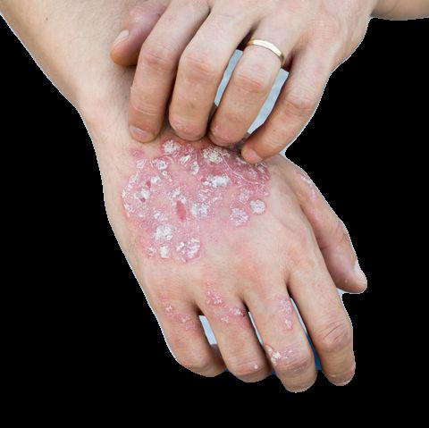
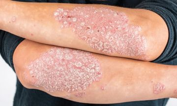
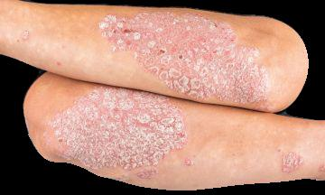

# Extracting foreground skin in dermatology images
This repository implements an image processing algoithm for isolating the foreground skin pixels along with the skin lesions from the background. The algorithm can be used as a pre-processing step before training convolutional nueral networks (CNN) and preventing the CNNs from focussing on irrelevant background pixels that might sometimes also be of similar color to the skin or lesions.

## Usage

You can simply run the algorithm by running the following command 

```
python3 skin_extract.py --image_path <input path (str)> --out_path <output path (str)>  --sigma <sigma (float)> --remove_pixels <remove pixels (int)>
```

To check what each argument does run the following:

```
python3 skin_extract.py --help
```

## Output

Input                                      |Output 
:-----------------------------------------:|:-----------------------------------------:
  | 


Input                                      |Output 
:-----------------------------------------:|:-----------------------------------------:
  | 


  


